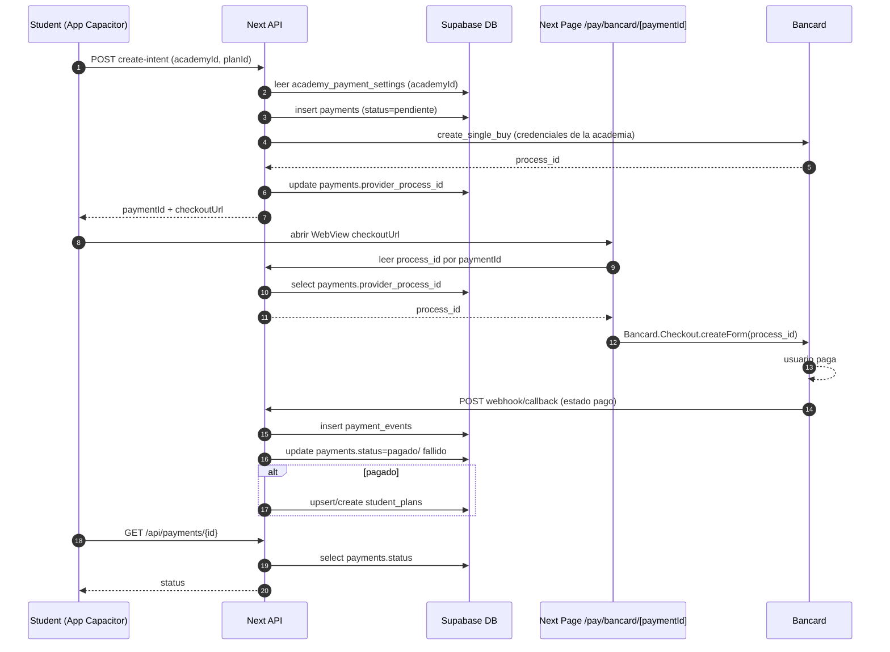

# Especificación técnica — Pagos in‑app con Bancard (multi‑merchant por academia)

Este documento describe **desde cero** cómo implementar el feature de **cobro dentro de la app móvil** (híbrida con Capacitor) usando **Bancard** como proveedor de pago, con el requisito de **multi‑merchant**: *cada academia cobra directo con sus credenciales Bancard*.

El objetivo es que cualquier desarrollador (o agente) pueda implementar el feature completo únicamente leyendo este documento.

---

## Convenciones del documento

- **Norma de oro**: el plan se acredita **solo** cuando el backend confirma el pago (webhook/callback) y aplica idempotencia.
- **Sección “Plantillas”**: incluye JSONs listos para copiar/pegar y adaptar.
- **Sección “SQL”**: incluye DDL mínimo sugerido (ajustar a tu schema real).
- **Sección “Mermaid”**: diagramas para entender el flujo de punta a punta.

---

## 0) Alcance

### 0.1 MVP (lo que SÍ incluye)

- **Plataformas**: iOS + Android (App Store + Play Store).
- **Checkout**: embebido en app vía **WebView** usando `bancard-checkout.js`.
- **Producto**: compra de **planes paquete** (ej: 8 clases, 12 clases).
- **Pagador**: el alumno paga **su propio plan**.
- **Modelo**: multi‑merchant por academia desde el día 1.
- **Confirmación**: acreditación del plan solo con confirmación server-to-server (webhook/callback).
- **Web/PWA en paralelo**: se mantiene para `admin` / `super_admin` (incluye configuración de pagos por academia).

### 0.2 Fuera de alcance (V2)

- Dinelco Link.
- Gift/vouchers.
- Pagos offline.

---

## 1) Contexto del stack actual

- **Frontend web/PWA**: Next.js (App Router).
- **Backend**: Next.js API Routes bajo `src/app/api/*`.
- **Auth/DB**: Supabase.
- **Roles**: `super_admin`, `admin`, `coach`, `student`.
- **Multi‑academia**: selección de academia activa en `localStorage` como `selectedAcademyId`.

---

## 1.1 Arquitectura objetivo (alto nivel)

```mermaid
flowchart LR
  subgraph Mobile[App móvil (Capacitor)]
    A1[Pantalla: Comprar plan]
    A2[WebView: Checkout]
  end

  subgraph Web[Web/PWA Next.js]
    W1[UI Admin: Config Bancard por academia]
    W2[Page /pay/bancard/[paymentId]]
  end

  subgraph API[Next.js API Routes]
    B1[POST /api/payments/bancard/create-intent]
    B2[POST /api/payments/bancard/webhook]
    B3[POST /api/admin/payment-settings/bancard/upsert]
    B4[GET /api/payments/:id]
  end

  subgraph DB[Supabase]
    D1[(academy_payment_settings)]
    D2[(payments)]
    D3[(student_plans)]
    D4[(payment_events)]
  end

  P[Bancard vPOS]

  A1 --> B1
  B1 --> D1
  B1 --> D2
  B1 --> P
  B1 --> A2
  A2 --> W2
  W2 --> P
  P --> B2
  B2 --> D2
  B2 --> D3
  B2 --> D4
  W1 --> B3
  B3 --> D1
  A1 --> B4
  B4 --> D2
```

---

## 2) Requisitos funcionales

### 2.1 Compra y acreditación

- El alumno selecciona un plan paquete para la academia activa.
- El sistema inicia una transacción con Bancard usando las **credenciales de esa academia**.
- El alumno paga.
- Al confirmarse el pago, el sistema:
  - registra el pago como `pagado`.
  - acredita el plan al alumno para esa academia (crea/actualiza `student_plans`).

### 2.2 Estados y resiliencia

- La acreditación del plan debe ser **idempotente**.
- La confirmación del pago debe manejar reintentos de webhook y callbacks duplicados.
- Deben existir estados claros para pago fallido/cancelado.

### 2.3 Permisos

- Solo `admin`/`super_admin` pueden configurar credenciales Bancard de una academia.
- Un `admin` solo puede configurar academias donde tenga asignación admin (tabla `user_academies`).

---

## 3) Requisitos no funcionales

- **Seguridad**: secrets de Bancard jamás deben llegar al cliente.
- **Observabilidad**: logs de:
  - creación de intento
  - callback/webhook
  - acreditación de plan
- **Compatibilidad stores**:
  - Se cobra por un servicio físico/presencial (clases), no por contenido digital.

---

## 4) Integración Bancard (modelo conceptual)

### 4.1 Artefactos

- `process_id`: identificador devuelto por Bancard (vPOS) que se usa para renderizar el formulario embebido.
- `bancard-checkout.js`: librería que monta el checkout en un contenedor HTML, usando `process_id`.

### 4.2 Flujo técnico del checkout embebido

1. Backend llama a Bancard para crear una compra (ej: operación `create_single_buy`) y recibe `process_id`.
2. Frontend carga `bancard-checkout.js` y ejecuta:
   - `Bancard.Checkout.createForm(containerId, processId, options)`
3. Bancard procesa pago.
4. Bancard llama a un callback/webhook configurado para informar el resultado.

> Nota: los nombres exactos de credenciales y endpoints varían según el contrato/portal de comercios. Este documento define una interfaz interna para aislar esa variación.

---

## 4.3 Secuencia end-to-end (MVP)



---

## 5) Modelo de datos

### 5.1 Tabla: `academy_payment_settings`

Propósito: guardar configuración de cobro por academia y proveedor.

Campos recomendados:

- `id` UUID PK
- `academy_id` UUID (FK a `academies.id`) **UNIQUE** (una config activa por academia para Bancard)
- `provider` TEXT (para MVP: `'bancard'`)
- `environment` TEXT (`'test'` | `'prod'`)
- `is_enabled` BOOLEAN

Credenciales (nombres genéricos; mapear a los reales cuando Bancard entregue el paquete):

- `merchant_id` TEXT NULL
- `terminal_id` TEXT NULL
- `public_key` TEXT NULL
- `private_key` TEXT NULL
- `api_base_url` TEXT NULL (opcional; útil si test/prod tienen distinto host)

Auditoría:

- `created_at` TIMESTAMP
- `updated_at` TIMESTAMP
- `updated_by` UUID NULL (user id)

Recomendaciones:

- Guardar `private_key` cifrada si es posible.
- En Supabase, aplicar RLS estricta (ver sección 6).

---

## 5.4 SQL sugerido (mínimo) — adaptar a tu schema

> Este bloque es **orientativo**. Ajustar nombres de tablas/columnas a tu `schema.sql` y convenciones.

```sql
create table if not exists public.academy_payment_settings (
  id uuid primary key default gen_random_uuid(),
  academy_id uuid not null references public.academies(id) on delete cascade,
  provider text not null default 'bancard',
  environment text not null check (environment in ('test','prod')),
  is_enabled boolean not null default false,

  merchant_id text null,
  terminal_id text null,
  public_key text null,
  private_key text null,
  api_base_url text null,

  updated_by uuid null,
  created_at timestamptz not null default now(),
  updated_at timestamptz not null default now(),

  constraint academy_payment_settings_academy_provider_uniq unique (academy_id, provider)
);

alter table public.payments
  add column if not exists academy_id uuid null references public.academies(id),
  add column if not exists provider text null,
  add column if not exists provider_process_id text null,
  add column if not exists provider_transaction_id text null,
  add column if not exists provider_status text null,
  add column if not exists paid_at timestamptz null,
  add column if not exists idempotency_key text null,
  add column if not exists metadata jsonb null;

create unique index if not exists payments_idempotency_key_uniq on public.payments(idempotency_key) where idempotency_key is not null;

create table if not exists public.payment_events (
  id uuid primary key default gen_random_uuid(),
  payment_id uuid not null references public.payments(id) on delete cascade,
  event_type text not null,
  payload jsonb not null,
  received_at timestamptz not null default now()
);
```

### 5.2 Extender tabla: `payments`

Propósito: registrar transacciones de pago.

Agregar campos:

- `academy_id` UUID NULL
- `provider` TEXT NULL (ej: `bancard`)
- `provider_process_id` TEXT NULL
- `provider_transaction_id` TEXT NULL
- `provider_status` TEXT NULL
- `status` TEXT (ya existe; asegurar valores `pendiente|pagado|fallido|cancelado`)
- `paid_at` TIMESTAMP NULL
- `idempotency_key` TEXT NULL (UNIQUE recomendado)
- `metadata` JSONB NULL

### 5.3 Tabla opcional: `payment_events`

Propósito: guardar historia de callbacks y auditoría.

- `id`
- `payment_id`
- `event_type` (callback/webhook)
- `payload` JSONB
- `received_at`

---

## 6) Seguridad (Supabase RLS + Service Role)

### 6.1 Principio

- La app cliente **no** debe leer ni escribir secretos.
- El backend (API routes Next.js) usa `supabaseAdmin`/service role para operar con secretos.

### 6.2 RLS sugerida

Para `academy_payment_settings`:

- **SELECT**: denegar para clientes.
- **INSERT/UPDATE/DELETE**: permitir solo desde backend con service role.

Para que admins puedan configurar sin exponer secrets al cliente:

- El frontend llama a endpoints internos `POST /api/admin/payment-settings/*`.
- El backend valida rol y pertenencia a academia, y escribe en DB con service role.

---

## 6.3 RLS sugerida (orientativa)

Objetivo: evitar que clientes lean/filtren secretos.

```sql
alter table public.academy_payment_settings enable row level security;

-- Bloquear todo para anon/authenticated (solo service role puede acceder)
revoke all on table public.academy_payment_settings from anon, authenticated;

-- (Opcional) si necesitás que el cliente lea si está habilitado SIN secretos,
-- crear una vista segura, por ejemplo:
-- create view public.academy_payment_public as
-- select academy_id, provider, environment, is_enabled, updated_at from public.academy_payment_settings;
-- y aplicar RLS/privilegios a esa vista.
```

Nota:

- En Supabase, el **service role** bypass RLS.
- Por simplicidad, en este feature el frontend nunca consulta `academy_payment_settings` directo; siempre va por API.

---

## 7) API interna (backend)

### 7.1 Admin API: guardar configuración Bancard

Endpoint:

- `POST /api/admin/payment-settings/bancard/upsert`

Body:

- `currentUserId`
- `academyId`
- `environment`: `test|prod`
- `isEnabled`: boolean
- `merchantId`, `terminalId`, `publicKey`, `privateKey`, `apiBaseUrl`

Validaciones:

1. `currentUserId` existe.
2. Rol del usuario (`profiles.role`) es `admin` o `super_admin`.
3. Si rol es `admin`, validar que tenga asignación admin en `user_academies` para `academyId`.
4. Validar formato de campos obligatorios.

Respuesta:

- `{ success: true }` o `{ error }`.

---

## 7.1.1 Plantillas (Admin Upsert)

Request:

```json
{
  "academyId": "00000000-0000-0000-0000-000000000000",
  "environment": "test",
  "isEnabled": true,
  "merchantId": "...",
  "terminalId": "...",
  "publicKey": "...",
  "privateKey": "...",
  "apiBaseUrl": "..."
}
```

Response OK:

```json
{ "success": true }
```

Response error (ejemplo):

```json
{ "error": "No autorizado" }
```

### 7.2 Student API: crear intento de pago

Endpoint:

- `POST /api/payments/bancard/create-intent`

Body:

- `currentUserId`
- `academyId`
- `planId`

Validaciones:

1. `currentUserId` autenticado.
2. Obtener rol del usuario (debe ser `student`).
3. Resolver `studentId` desde `students` por `user_id`.
4. Validar que el usuario esté asignado a `academyId` con rol `student` y `is_active=true`.
5. Cargar configuración de Bancard de `academy_payment_settings`:
   - `provider='bancard'`
   - `is_enabled=true`
   - `environment` definido

Cálculo del monto:

- Obtener plan desde `plans`.
- Definir precio final (si hay descuentos, aplicarlos aquí).

Persistencia:

- Crear fila en `payments` con:
  - `status='pendiente'`
  - `academy_id`, `student_id`, `plan_id` (según tu modelo actual)
  - `provider='bancard'`
  - `idempotency_key` (ej: UUID v4)

Crear compra en Bancard:

- Llamar a un módulo interno `bancardClient.createSingleBuy(...)` usando credenciales de esa academia.
- Guardar `provider_process_id` en `payments`.

Respuesta:

- `paymentId`
- `processId`
- `checkoutUrl`: `/pay/bancard/${paymentId}`

---

## 7.2.1 Plantillas (Create Intent)

Request:

```json
{
  "academyId": "00000000-0000-0000-0000-000000000000",
  "planId": "00000000-0000-0000-0000-000000000000"
}
```

Response OK:

```json
{
  "paymentId": "00000000-0000-0000-0000-000000000000",
  "processId": "<bancard_process_id>",
  "checkoutUrl": "/pay/bancard/00000000-0000-0000-0000-000000000000"
}
```

Errores típicos:

- `Academia sin cobro configurado`
- `Plan inválido`
- `No autorizado`

### 7.3 Página de checkout embebido

Ruta web (Next page):

- `/pay/bancard/[paymentId]`

Responsabilidad:

- Leer `paymentId`.
- Consultar backend (service role) para obtener `provider_process_id`.
- Renderizar HTML que incluya `bancard-checkout.js` y monte el checkout.

Importante:

- No exponer secrets.
- El `process_id` sí se entrega al JS.

---

## 7.3.1 Plantilla (HTML conceptual de checkout)

> La implementación real será una page Next.js. Esto es el **mínimo conceptual**.

```html
<div id="iframe-container"></div>
<script src="/path/to/bancard-checkout.js"></script>
<script>
  const processId = "[PROCESS_ID]";
  const options = {};
  Bancard.Checkout.createForm('iframe-container', processId, options);
</script>
```

### 7.4 Callback/Webhook Bancard

Endpoint:

- `POST /api/payments/bancard/webhook`

Responsabilidad:

1. Validar autenticidad (si Bancard provee firma/token/secret compartido).
2. Extraer identificadores del pago:
   - ideal: `paymentId` interno en metadata enviada a Bancard
   - alternativa: mapear por `process_id`
3. Registrar `payment_events`.
4. Resolver estado final.

Idempotencia:

- Si `payments.status` ya es `pagado`, retornar 200.
- Si webhook duplicado, no duplicar acreditación.

Acreditación del plan:

- Al aprobar:
  - actualizar `payments.status='pagado'`, `paid_at=now`, `provider_status`
  - crear `student_plans`:
    - `student_id`
    - `plan_id`
    - `academy_id`
    - `remaining_classes` = `plans.classes_included` (o según reglas)
    - `purchased_at` = now
  - opcional: registrar un `notification_event` y enviar push.

Al rechazar:

- `payments.status='fallido'`

---

## 7.4.1 Plantilla (Webhook)

Como no tenemos el contrato exacto aún, se define un **modelo interno** al que se mapea el payload real de Bancard:

```json
{
  "provider": "bancard",
  "environment": "test",
  "processId": "<bancard_process_id>",
  "transactionId": "<optional>",
  "status": "approved",
  "raw": { "...": "payload_original" }
}
```

Regla de mapeo:

- Si no llega `paymentId` explícito, resolver por `processId` (buscar en `payments.provider_process_id`).

---

## 8) Módulo Bancard (abstracción)

Crear un wrapper para aislar la variación real de credenciales.

### 8.1 Interfaz

`bancardClient.createSingleBuy({
  amount,
  currency,
  description,
  externalReference, // paymentId interno
  returnUrl,
  cancelUrl,
  environment,
  credentials,
}) -> { processId, rawResponse }`

### 8.2 Mapeo de credenciales

Hasta tener documentación contractual, usar estructura genérica:

`credentials = { merchantId, terminalId, publicKey, privateKey, apiBaseUrl }`

---

## 8.3 Variables de entorno (backend)

El backend debe tener:

- `BANCARD_DEFAULT_API_BASE_URL_TEST` (opcional)
- `BANCARD_DEFAULT_API_BASE_URL_PROD` (opcional)

Y los secrets de Supabase ya existentes:

- `SUPABASE_SERVICE_ROLE_KEY`

Nota:

- En multi‑merchant, las credenciales viven en DB por academia, pero estos defaults ayudan si Bancard separa hosts por ambiente.

---

## 9) UI Web (Admin) — Configuración por academia

Ubicación recomendada:

- `/settings` (sección: “Cobros / Bancard”)

Requisitos UI:

- Selector de academia activa (ya existe).
- Campos para:
  - environment test/prod
  - habilitar/deshabilitar
  - credenciales
- Botón Guardar.
- Mensajes de error claros.

Buenas prácticas:

- Mostrar solo parte del `private_key` (ej: `****abcd`).
- Permitir actualizarlo (si el admin lo reescribe).

---

## 9.1 Checklist funcional de la pantalla Admin

- **Mostrar academia activa** (y permitir cambiarla si tu UI lo permite).
- **Habilitar cobros** (toggle `is_enabled`).
- **Ambiente** (selector `test/prod`).
- **Campos credenciales** (texto, con ocultación parcial para `private_key`).
- **Guardar**.
- **Validación inmediata**:
  - si `is_enabled=true` y faltan campos mínimos, bloquear guardar.
- **Mensaje de estado**:
  - “Configuración guardada”
  - errores detallados (pero sin imprimir secrets).

---

## 10) App móvil (Capacitor) — Flujo de compra

### 10.1 Pantallas

- “Comprar plan” (lista de planes)
- “Checkout Bancard” (WebView con `/pay/bancard/[paymentId]`)
- “Resultado” (pendiente / aprobado / rechazado)

### 10.2 Secuencia recomendada

1. Alumno elige plan.
2. App llama `create-intent`.
3. Abre WebView a `checkoutUrl`.
4. Al volver (deep link o botón), app consulta `GET /api/payments/{id}`.
5. Si `pagado`, refrescar saldo y mostrar plan acreditado.

### 10.3 Deep links

- Definir un esquema `agendo://` o universal links para retornar del checkout.

---

## 10.4 Notas específicas de Capacitor (WebView)

- En iOS/Android, el checkout embebido depende del WebView del sistema.
- Evitar bloquear third‑party cookies si Bancard depende de ellas (se valida en QA).
- Si Bancard requiere abrir páginas externas (3DS, banco), usar `Browser.open` de Capacitor o permitir navegación controlada.

---

## 11) QA / Testing

### 11.1 Test environment

- Cargar credenciales de test por academia.
- Validar que cada academia genera process_id propio.

### 11.2 Casos de prueba mínimos

- Pago aprobado.
- Pago rechazado.
- Usuario intenta pagar plan de otra academia.
- Webhook duplicado (idempotencia).
- Reintento de pago: crear 2 intents seguidos, solo uno debe acreditar.

Agregar casos:

- Config de academia incompleta (no debe permitir iniciar pago).
- Academia A y B con credenciales distintas: ambas deben generar checkout válido.
- Reintento webhook (mismo payload 2 veces): sin duplicar plan.

### 11.3 Observabilidad

- Loggear:
  - `paymentId`, `academyId`, `processId`
  - estado final
  - tiempo de confirmación

---

## 12) Checklist App Store / Play Store (pago por servicios físicos)

- Describir claramente que se paga por **clases presenciales**.
- Políticas de privacidad y Términos.
- Justificar permisos (notificaciones, cámara si QR, etc.).
- Evitar wording tipo “comprar contenido digital”.

---

## 13) Plan de implementación (orden sugerido)

1. DB: crear `academy_payment_settings` + extender `payments`.
2. Backend admin endpoint upsert settings.
3. UI web `/settings` para configurar Bancard.
4. Endpoint `create-intent`.
5. Página `/pay/bancard/[paymentId]` con `bancard-checkout.js`.
6. Webhook/callback y acreditación.
7. App móvil: flujo de compra + pantalla checkout.
8. QA y hardening.

---

## 13.1 Plan por hitos (para ejecutar desde cero)

Hito A — Base DB y seguridad:

- Crear tabla `academy_payment_settings`.
- Extender `payments`.
- (Opcional) Crear `payment_events`.
- Configurar RLS/privilegios para que clientes no lean secrets.

Hito B — Panel Admin (web):

- Endpoint `upsert`.
- UI de configuración por academia.

Hito C — Flujo de compra (backend + web checkout):

- Endpoint `create-intent`.
- Page `/pay/bancard/[paymentId]`.

Hito D — Confirmación:

- Webhook/callback.
- Idempotencia.
- Acreditación `student_plans`.

Hito E — App móvil:

- Pantalla planes.
- Abrir WebView checkout.
- Manejo retorno + status.

---

## 14) Preguntas abiertas (para completar cuando Bancard entregue el paquete)

- Nombres exactos de credenciales requeridas.
- Formato y firma del webhook/callback.
- Endpoints exactos test/prod.
- Campos que devuelve la confirmación (transaction_id, status codes).

Cuando se reciban estos datos, actualizar:

- `academy_payment_settings` (campos definitivos).
- `bancardClient` (mapping real).
- validación de webhook.

---

## 15) Cómo trabajar “desde cero” en este repo (Windsurf) para el feature

Objetivo: poder desarrollar iterativamente (como venimos haciendo) usando este mismo IDE.

Requisitos mínimos:

- Acceso al repo (este proyecto).
- Node.js instalado.
- Acceso a Supabase (URL + keys) para dev/test.

Estrategia de trabajo:

- Mantener el checkout como **página web dentro del mismo Next.js** (`/pay/bancard/[paymentId]`).
- La app Capacitor solo abre esa URL en WebView.
- Toda la lógica sensible (credenciales, firma, webhook) queda en backend.

Esto permite que el desarrollo sea:

- reproducible
- revisable
- con cambios chicos

Checklist inicial de “bootstrap” (conceptual):

- Confirmar que el proyecto web corre local.
- Crear migraciones SQL (o scripts) para nuevas tablas/campos.
- Implementar endpoints.
- Implementar UI admin.
- Recién después crear el wrapper Capacitor y conectar el flujo.
